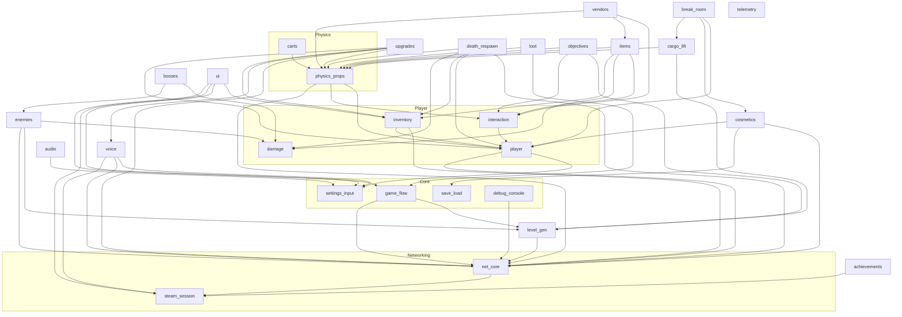

# Lab Escape architecture

This is the map of the whole game's code. Each box is a **system**: a separate piece of the game
with its own folder (`res://systems/<name>/`), its own spec (`docs/systems/<name>.md`) and its own
tests, so different people can build different systems at the same time and merge them later.

A few words used everywhere:
- **Host**: the player whose PC runs the game for the lobby. Its copy of the game is the truth.
- **Client**: every other player. Clients send requests to the host and show what the host decides.
- **Autoload**: a script Godot starts once when the game launches and keeps forever. Every script
  can reach it by name, e.g. `EventBus` or `Net`.
- **Component**: a small node you add to an object to give it an ability, e.g. a `HealthComponent`
  makes something damageable.
- **Content**: data files (`.tres`) that describe a mutation, an item, an enemy, a room, and so on.
- **Signal / event**: a "this just happened" message. Other code can listen for it.
- **RPC** (remote procedure call): a function call sent over the network to another PC.

## The systems

31 specs in `docs/systems/` (29 systems still to build, plus the 2 foundation specs). Size: S = a few days, M = about a week or two, L = several weeks (for a beginner with Claude Code).

### Foundation (already written)
| System | What it does | Size |
|---|---|---|
| **foundation** | `Config` (tuning numbers), `ContentRegistry` (finds all content files), every content data class, `ContentValidator`, `InputActions`, `PhysicsLayers`, `SeededRng`. | done |
| **event_bus** | The `EventBus` autoload: every shared "something happened" signal, and the rules for using them. | done |

### Core
| System | What it does | Size |
|---|---|---|
| **game_flow** | The game's big state machine: main menu → Break Room → run → floors → boss → end → Break Room. Owns the run (seed, floor number, department order) and difficulty scaling. Loads scenes. | M |
| **settings_input** | Settings (audio, video, mouse, accessibility), key rebinding, settings file. | S |
| **save_load** | The player's profile on their own PC: unlocked cosmetics, chosen outfit, lifetime stats. Versioned. | S |
| **debug_console** | In-game console and cheats. Other systems register commands. Spawns any content by id. | S |

### Networking
| System | What it does | Size |
|---|---|---|
| **steam_session** | Starts Steam, creates/joins lobbies, friend invites, rich presence, and the network connection. Has a local (no Steam) mode for testing. | M |
| **net_core** | Who is in the game (the roster), host/client helpers, joining rules, disconnects and reconnects. Keeps each player's run record (mutations, cybernetics) on the host. | M |

### Player
| System | What it does | Size |
|---|---|---|
| **player** | The first-person body: movement, camera, crouch, movement modes (wall climb, slide, hop), attach points for mutations and cosmetics, syncing to other players. | L |
| **damage** | Health, damage types (fire, blunt...), status effects (burning, speed boost), hitboxes. Used by players, enemies, bosses and breakable props. | M |
| **interaction** | What the player is looking at, the "Press E to..." prompt, and sending "use" to the right object. | S |
| **inventory** | Inventory slots for weapons and tools, switching, extra slots from upgrades, dropping everything. | M |

### Physics objects
| System | What it does | Size |
|---|---|---|
| **physics_props** | Networked physics objects (gems, meat, crates, robot parts, lift parts), Half-Life 2 style grab/carry/throw with local prediction, two-player lifting, safe respawn for key objects, performance limits. **Highest risk.** | L |
| **carts** | Pushable carts that carry many props (props snap in and freeze). One pusher at a time. | M |

### Upgrades, death, economy
| System | What it does | Size |
|---|---|---|
| **upgrades** | Mutations and cybernetics: the shared "hold it and press use to gain it" interaction, applying effect pieces, stacking and clash rules, keeping them through death. | L |
| **death_respawn** | Dying (drop everything), ghosts, meat, the 3D printer reprint, solo rule, team wipe. | M |
| **loot** | What drops when things die: gems, glow roll (with pity), meat, robot parts, items. Gem merging to limit lag. | M |
| **vendors** | Vending machines: put gems in, buy an item, change pops out, refund lever. Stock from data. | M |

### Voice and audio
| System | What it does | Size |
|---|---|---|
| **voice** | Steam voice chat, one audio bus per player, mutation voice effects, proximity volume, push-to-talk. **High risk.** | L |
| **audio** | Music per department, sound effects, 3D positional sound, the audio bus layout. | S |

### Combat and world
| System | What it does | Size |
|---|---|---|
| **items** | What items do: melee, throw, consume, use-on-object (water a plant to grow a ladder). Item pickups. | M |
| **enemies** | Shared enemy AI states (idle, patrol, chase, attack, flee), navigation, the floor spawner. Zoology enemies first. | L |
| **bosses** | Boss framework: phases, minions, arena. Giant rat first. | M |
| **level_gen** | Builds each floor from a library of pre-built rooms using the department's bundle. Places markers where vendors, printers, carts, enemies and tasks go. | L |
| **cargo_lift** | The cargo lift on each floor: lift parts, "everyone aboard" check, travel to the next floor carrying players, carts and props. Also powers the Break Room elevator. | M |
| **objectives** | Keycards and locked doors, co-op floor tasks (crane game, hamster wheel) as data. | M |

### Break Room and presentation
| System | What it does | Size |
|---|---|---|
| **break_room** | The fixed Break Room scene that is the lobby: spawn points, elevator start, "start anyway" for AFK players. | S |
| **cosmetics** | Cosmetic items, the jacket closet, unlocks, syncing everyone's look, fitting cosmetics onto mutated bodies. | M |
| **ui** | Main menu, HUD, inventory bar, pause and settings screens, death/reprint screen, run summary, toasts. | L |
| **achievements** | Data-driven Steam achievements and stats. | S |
| **telemetry** | Optional playtest log: writes run events to a file so the team can see what happened. Off in release. | S |

### What changed from the original list, and why
- **Merged** Steam init, lobby, invites and rich presence into **steam_session**: they are all thin
  wrappers around GodotSteam and are easiest to build and test together.
- **Split** player sync, authority helpers and disconnect handling into **net_core**, separate from
  Steam, so everything else can be tested with local (non-Steam) networking.
- **Merged** settings, input mapping and accessibility into **settings_input**: one settings file, one screen.
- **Added damage** as its own system: players, enemies, bosses and breakable props all need health,
  so it can't belong to any one of them.
- **Split interaction** from physics_props: "what am I looking at and what happens when I press E"
  is used by doors, vendors, buttons and the closet, not just physics.
- **Split** economy into **loot** (what drops) and **vendors** (spending), and progression into
  **cargo_lift** and **objectives**, and Break Room into **break_room** and **cosmetics**. Each half
  can be built by a different person.
- **Difficulty scaling** lives in **game_flow** (`RunDifficulty`), because game_flow knows the floor
  number and player count. Enemies, bosses and objectives read it.
- **Accessibility** is in settings_input (options) and ui (how they are shown).
- **Added telemetry** for playtest analytics. It only listens to EventBus, so it can be built any time.

## How data flows

### 1. Hosting and joining
Main menu (ui) → `SteamSession.host_lobby()` → Steam lobby created → `Net` sets up the host →
`GameFlow` loads the Break Room → the player system spawns the host's body.
A friend accepts an invite → `SteamSession` joins → `Net` checks joining is allowed (only while in
the Break Room) → `Net` adds them to the roster → `player_joined` → their body spawns for everyone.

### 2. Starting a run
Everyone walks into the elevator. Someone presses the button (interaction) → break_room asks the host →
host checks the `ElevatorZone` (cargo_lift) contains every player → `elevator_start_accepted` →
`GameFlow.start_run()` picks a seed and department order → **level_gen runs on the host only** and
sends the finished floor layout (a short list of rooms and positions) to every client → every PC
builds the same floor → `floor_ready` → on the host, each system finds its markers in the floor
and spawns its things (enemies, vendors, printers, carts, props, tasks).

### 3. Killing a monster and getting a mutation
Player hits a rat (items → damage) → rat's health hits 0 on the host → enemies emits `enemy_killed` →
loot (host) rolls the rat's loot table with the floor seed, rolls the glow chance (with pity) and
picks a mutation from the pool → `Props.spawn_prop(&"prop_gem", ...)` spawns a glowing gem for everyone →
a player grabs it (interaction → physics_props) → presses use → upgrades sends a request to the
host → host grants the mutation and stores it in that player's record (net_core) → every PC applies
the effect pieces (movement mode in player, voice effect in voice, extra slot in inventory,
wings in player attach points) → `upgrade_gained`.

### 4. Buying something
Players carry plain gems (by hand or cart) to a vending machine and drop or throw them into its slot →
the vendor (host) adds each gem's value to the credit of the player who last held it →
that player presses a button → vendor checks the price → spawns the item pickup (items) →
any extra gems pop back out as physics props. The refund lever spits everything back out.

### 5. Dying and being reprinted
Health hits 0 (damage) → death_respawn (host) makes inventory drop everything and releases any
held prop → `player_died` → the player becomes a ghost (spectator) → a teammate carries meat into a
3D printer → host checks the meat cost → reprints the player at the printer → their mutations and
cybernetics are re-applied from their record → `player_reprinted`. If everyone is dead at once:
`team_wiped` → `GameFlow` ends the run.

### 6. Finishing a floor
Players find lift parts (props, task rewards) and put them into the cargo lift → cargo_lift counts
them → `lift_ready` → everyone (and any carts and props) gets on → `lift_departed` → `GameFlow`
loads the next floor. Every 5th floor is the department's boss floor. Beating the last boss →
`run_ended(&"escaped")` → everyone returns to the Break Room → cosmetic unlocks are checked and saved.

## Dependency diagram

An arrow `A --> B` means "A uses B's public API". Every system also uses the foundation
(Config, EventBus, ContentRegistry, data classes); those arrows are left out to keep it readable.
Systems with no arrows into them can be built in parallel with each other once their own
arrows are satisfied (or stubbed).

Things that look like dependencies but are **not**, because they go through EventBus:
- loot listens for `enemy_killed`; enemies never call loot.
- game_flow listens for `team_wiped`, `lift_departed`, `elevator_start_accepted`, `boss_defeated`.
- achievements, telemetry, audio and the HUD only listen to events.
- cosmetics hides slots when it hears `upgrade_gained`.

## Autoloads (in load order)

| Autoload | System | Notes |
|---|---|---|
| `Config` | foundation | `Config.game` is the GameConfig. Registers default input actions. |
| `EventBus` | foundation | Signals only. |
| `ContentRegistry` | foundation | Scans `res://content/`. |
| `SaveSystem` | save_load | |
| `Settings` | settings_input | |
| `SteamSession` | steam_session | |
| `Net` | net_core | |
| `GameFlow` | game_flow | |
| `Level` | level_gen | The current floor and its markers. |
| `Props` | physics_props | Spawning and syncing props. |
| `Upgrades` | upgrades | |
| `Death` | death_respawn | |
| `Enemies` | enemies | Spawning enemies. |
| `Loot` | loot | |
| `Voice` | voice | |
| `Sound` | audio | ("Audio" clashes with Godot's own names.) |
| `Cosmetics` | cosmetics | |
| `UI` | ui | Screens, HUD and toasts. |
| `Achievements` | achievements | |
| `Telemetry` | telemetry | |
| `DebugConsole` | debug_console | Last, so every system can register commands in `_ready`. |

Each system adds its own autoload line to `project.godot` when it is merged.

## Key rules in one place
- Host decides; clients request. Players' own movement is the one exception (see CLAUDE.md §6).
- The host generates each floor and sends the layout; it never relies on every PC rolling the same dice.
- Every random roll uses `SeededRng` with its own stream name, so runs can be replayed from a seed.
- No hand-written content lists. Ask `ContentRegistry`.
- Never assume 4 players. Read `Config.game.max_players`, loop over `Net.get_player_ids()`.
